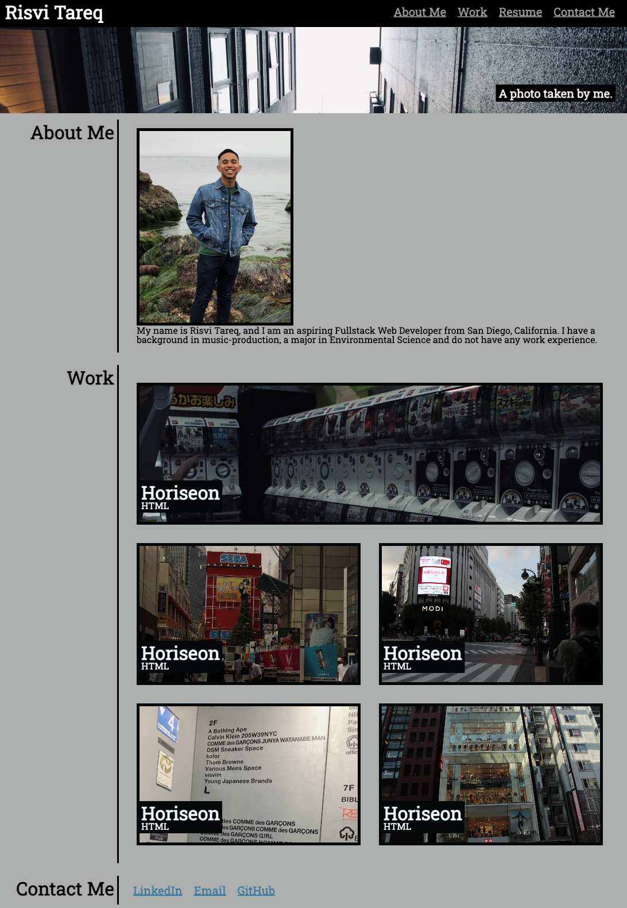

# Professional-Portfolio
Module 2 Challenge
## Description
I was assigned a project in which I had to create a Professional Portfolio using HTML and CSS. It contained various links to my contact information and serves as a landing page for my class projects. So far, it only contains one project, but it will serve as the basis for my future Professional Portfolio.

## Table of Contents
<nav>
    <ol>
        <li><a href="#How to Use this Project">How to Use this Project</a></li>
        <li><a href="#Credits">Credits</a></li>
        <li><a href="#License">License</a></li>
        <li><a href="#Contributors">Contributors</a></li>
    </ol>
</nav>

## How to Use this Project
<a href="">This is the link to my WebPage</a>

## License
